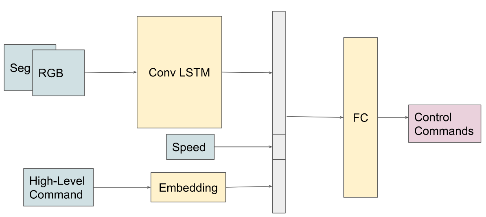

# Obstacle Avoidance for Autonomous Driving in CARLA Using Segmentation Deep Learning Models

## Model Architecture
```

```
## Usage
### Data collector
To run the data collector: 
1. Run `CarlaUE4.sh` in your CARLA installation path
2. `python data_collector_tm.py --dataset_path <DATASET_PATH> --episode_file <TRAIN_EPISODE_FILE> --n_episodes <NUMBER OF EPISODES>`

Example usage:
`python data_collector_tm.py --dataset_path ./data --episode_file Town01_All.txt --n_episodes 10`
will randomly sample 10 episodes from `Town01_All.txt` and save the hdf5 files in `./data`.

### Training
Follow the instructions in `ModifiedDeepestLSTMTinyPilotNet/train.ipynb`.
**TODO:** put training code in a script

### Testing

 1. Run `CarlaUE4.sh -renderOffScreen` in your CARLA installation path
2. Run `python test_model.py --episode_file <TEST_EPISODE_FILE> --model <MODEL_FILE> --n_episodes <NUMBER OF EPISODES>`

 
 A pygame window should pop up and testing automatically starts. At the end of testing, the following metrics will be reported
 - **Success rate**: $\frac{\text{number of successful episodes}}{\text{total number of episodes}}$
 - **Success rate weighted by track length**: $\frac{\sum S_i l_i}{\sum l_i}$ where $S_i = 0$ if the agent fails to arrive at the target location in episode $i$ and $S_i = 1$ otherwise, and $l_i$ is the distance traveled by the agent.
 - **Average distance traveled before collision**: the average distance traveled by the agent before a collision occurs, calculated for failed cases only

Example usage:
`python test_model.py --episode_file Town02_All.txt --model "ModifiedDeepestLSTMTinyPilotNet/models/v6.2.pth" --n_episodes 100` will test the `v6.2` model in Town02 for 100 randomly sampled episodes from `Town02_All.txt`.
